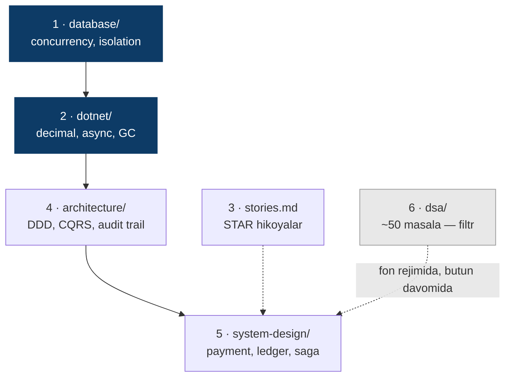
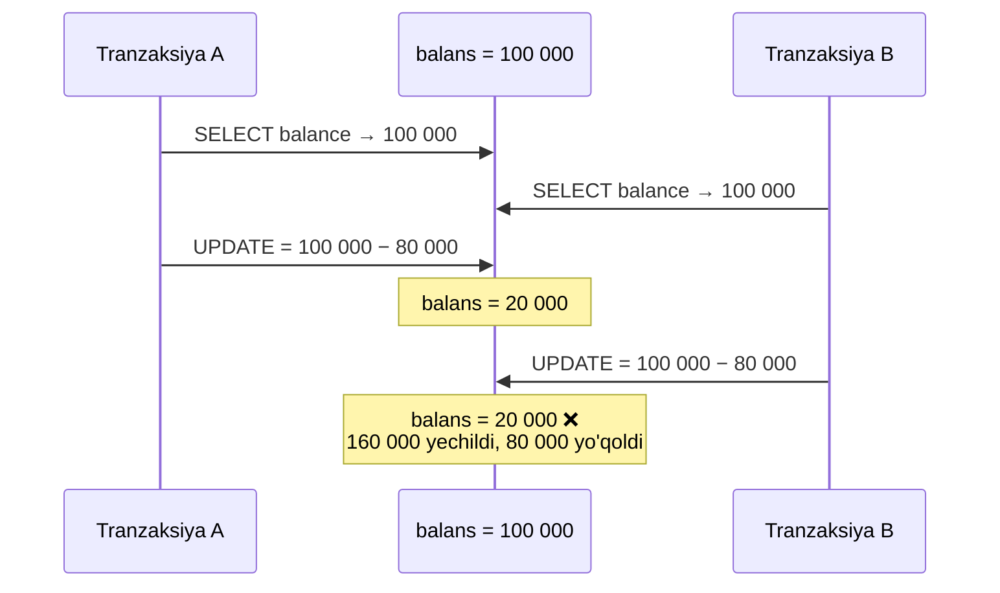
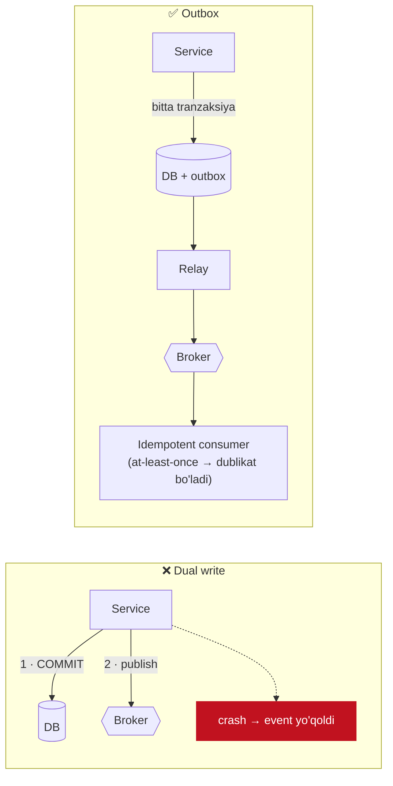
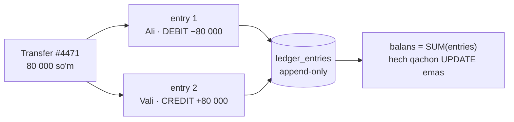

# PROGPREP

**Maqsad:** Middle+ / Senior .NET backend — **mahalliy fintech** (Payme, Click, Uzum, banklar). 12 hafta.

Muvaffaqiyat mezoni "0% reject" emas — bunga erishib bo'lmaydi.
Mezon: **agar reject olsam, sababi mening bilimim bo'lmasin.**

---

## 3 ta qoida

**1. Har hafta DELIVERABLE bo'lishi shart.**
Yozilgan kod, yechilgan masala, design hujjati, yozib olingan mock.
"Video ko'rdim", "maqola o'qidim" — deliverable EMAS.

**2. Har bir kod testsiz yozilmaydi.**
Bu shu yerdagi eng muhim qoida. Testni alohida "mavzu" qilib qo'ymaslik uchun
`testing/` papkasi ataylab yo'q — test har bir loyihaning ichida yashaydi.

Sabab: test yozmaslik — mening asosiy zaifligim, va u meni jimgina regressiyaga
olib kelgan. Oddiy kompaniyada bu kamchilik. **Fintech'da bu veto** — pul yo'qoladi.
"Kodingiz to'g'riligini qanday kafolatlaysiz?" savoli menga albatta beriladi.

**3. Papka strukturasini kengaytirish — ish emas.**
Beshta papka. Ro'yxat yopiq. Yangi papka yaratish yoqimli va xatarsiz,
lekin u bironta masalani yechmaydi. Bu prokrastinatsiyaning eng chiroyli shakli.

---

## Ustuvorlik (mahalliy fintech uchun)



| # | Papka | Nega |
|---|---|---|
| 1 | `database/` | Concurrency + isolation. **"Ikki kishi bir vaqtda bitta hisobdan pul yechsa?"** — bu savol albatta beriladi |
| 2 | `dotnet/` | .NET chuqurligi + pul bilan ishlash (`decimal`, rounding). Asosiy round |
| 3 | `stories.md` | Mening eng kuchli qurolim — pastga qarang |
| 4 | `architecture/` | SOLID, DDD, CQRS, audit trail / event sourcing |
| 5 | `system-design/` | Payment, ledger, saga, idempotency |
| 6 | `dsa/` | Yengil filtr. ~50 masala yetadi (NeetCode 150 emas). O'tish kifoya, porlash shart emas |

---

## Fintech'ga xos mavzular

Bular alohida papka emas — mavjud beshtaga tushadi.

**`dotnet/`**
- **Pulni `double`/`float` da saqlash — interview shu yerda tugaydi.** `decimal`.
  Sabab: IEEE 754 binary float 0.1 ni aniq ifodalay olmaydi.
- Rounding: banker's rounding (`MidpointRounding.ToEven`), precision, minor units (tiyin — butun son)

**`database/`** ⭐ eng muhim
- Lost update — ikki parallel balans yangilanishi
- Optimistic vs pessimistic locking — **qaysi biri va NEGA**
- Isolation levels — Read Committed'da qanday anomaliya qoladi
- `SELECT ... FOR UPDATE`, row-level lock, deadlock

**Lost update — interview'da chiziladigan chizma:**



Yechim ikkita, va **qaysi birini tanlaganingizni izohlay olish** javobning yarmi:

| | Pessimistic | Optimistic |
|---|---|---|
| Qanday | `SELECT ... FOR UPDATE` — qator qulflanadi | `rowversion` / `xmin` — yozishda tekshiriladi |
| Narxi | Kutish, deadlock xavfi | Konflikt bo'lsa retry kerak |
| Qachon | Konflikt **tez-tez** (issiq hisob, kassa) | Konflikt **kam** (user profili) |

**`architecture/`**
- Audit trail — yozuv o'chirilmaydi va o'zgartirilmaydi, faqat qo'shiladi
- Event sourcing asoslari

**`system-design/designs/`**
- `payment-system.md` — idempotency key (Stripe uslubi), retry, exactly-once illyuziyasi
- `ledger.md` — double-entry bookkeeping. **Fintech system design'ning markazi.**
  Balansni `UPDATE` qilmaysiz — immutable yozuvlar qo'shasiz.
- `wallet-balance.md` — concurrency
- `saga-outbox.md` — tarqoq tranzaksiya. **Menda bu muammo allaqachon bor** → hikoya tayyor

---

## Manbalar

Tartib yuqoridagi ustuvorlik bilan bir xil. **O'qish deliverable emas** — shuning uchun
har bir manbaning yonida uni yopadigan aniq ish turibdi. `[ ]` → `[x]` faqat deliverable
tayyor bo'lganda.

### 1. Database ⭐

| ✓ | Manba | Deliverable |
|---|---|---|
| [ ] | [A Critique of ANSI SQL Isolation Levels](https://arxiv.org/pdf/cs/0701157) — Berenson, Bernstein, Gray va b., 1995 ([CMU nusxasi](https://www.cs.cmu.edu/~15721-f24/papers/Critique_of_ANSI_Isolation_Levels.pdf)) | 4 anomaliyani o'z so'zim bilan `database/README.md` ga yozish |
| [ ] | [PostgreSQL — Transaction Isolation](https://www.postgresql.org/docs/current/transaction-iso.html) | Read Committed'da lost update'ni reproduce qiluvchi test |
| [ ] | [PostgreSQL — Explicit Locking](https://www.postgresql.org/docs/current/explicit-locking.html) | `SELECT ... FOR UPDATE` bilan balans yechish + parallel test |
| [ ] | [EF Core — Concurrency conflicts](https://learn.microsoft.com/en-us/ef/core/saving/concurrency) | `rowversion` token, `DbUpdateConcurrencyException` testda ushlanadi |
| [ ] | [SQL Server — Locking & row versioning guide](https://learn.microsoft.com/en-us/sql/relational-databases/sql-server-transaction-locking-and-row-versioning-guide) | Ataylab deadlock yasash, log'ni o'qib izohlash |

### 2. .NET va pul

| ✓ | Manba | Deliverable |
|---|---|---|
| [ ] | [Goldberg — Floating-Point Arithmetic](https://docs.oracle.com/cd/E19957-01/806-3568/ncg_goldberg.html) (kirish qismi yetadi) | `0.1 + 0.2 != 0.3` ni `double` da ko'rsatuvchi test |
| [ ] | [`System.Decimal`](https://learn.microsoft.com/en-us/dotnet/api/system.decimal) + [`MidpointRounding`](https://learn.microsoft.com/en-us/dotnet/api/system.midpointrounding) | `ToEven` vs `AwayFromZero` unit-testlari; tiyin = butun son |
| [ ] | [Stephen Cleary — There Is No Thread](https://blog.stephencleary.com/2013/11/there-is-no-thread.html) | "async thread yaratadimi?" — 3 jumlalik javob |
| [ ] | [Async/await best practices](https://learn.microsoft.com/en-us/archive/msdn-magazine/2013/march/async-await-best-practices-in-asynchronous-programming) | `.Result` deadlock'ini reproduce qilish |
| [ ] | [.NET GC fundamentals](https://learn.microsoft.com/en-us/dotnet/standard/garbage-collection/fundamentals) | Gen0/1/2 va LOH ni bir sahifada tushuntirish |
| [ ] | [DI service lifetimes](https://learn.microsoft.com/en-us/dotnet/core/extensions/dependency-injection) | Captive dependency bug'ini yasab, keyin tuzatish |

### 3. Architecture

| ✓ | Manba | Deliverable |
|---|---|---|
| [ ] | [Transactional Outbox](https://microservices.io/patterns/data/transactional-outbox.html) | Outbox jadval sxemasi + relay skeleti |
| [ ] | [Idempotent Consumer](https://microservices.io/patterns/communication-style/idempotent-consumer.html) | Dublikat xabar ikki marta qo'llanmasligini isbotlovchi test |
| [ ] | [Saga](https://microservices.io/patterns/data/saga.html) | To'lov saga diagrammasi, compensating transaction bilan |
| [ ] | [Fowler — Event Sourcing](https://martinfowler.com/eaaDev/EventSourcing.html) | Append-only ledger: yozuv o'chirilmaydi |
| [ ] | [Fowler — CQRS](https://martinfowler.com/bliki/CQRS.html) | Qachon kerak **EMAS**ligini ham yozish |
| [ ] | [Fowler — Bounded Context](https://martinfowler.com/bliki/BoundedContext.html) | Payment domenini kontekstlarga bo'lish |

**Dual-write muammosi va outbox — nima uchun kerakligi:**



### 4. System design (fintech)

| ✓ | Manba | Deliverable |
|---|---|---|
| [ ] | [Stripe — Idempotent requests](https://docs.stripe.com/api/idempotent_requests) | `Idempotency-Key` handler + retry testi |
| [ ] | Modern Treasury — Accounting for Developers [I](https://www.moderntreasury.com/journal/accounting-for-developers-part-i) · [II](https://www.moderntreasury.com/journal/accounting-for-developers-part-ii) · [III](https://www.moderntreasury.com/journal/accounting-for-developers-part-iii) | Double-entry ledger sxemasi |
| [ ] | [Immutability in a Double-Entry Ledger](https://www.moderntreasury.com/journal/enforcing-immutability-in-your-double-entry-ledger) | Audit trail: faqat `INSERT`, hech qachon `UPDATE`/`DELETE` |
| [ ] | [Polly — Retry / Circuit Breaker](https://github.com/App-vNext/Polly) | Jitter bilan retry policy + circuit breaker |

**Double-entry — har o'tkazma ikki yozuv, yig'indisi doim nol:**



### 5. DSA — yengil filtr

~50 masala yetadi. O'tish kifoya, porlash shart emas.

| ✓ | Manba | Deliverable |
|---|---|---|
| [ ] | [NeetCode Roadmap](https://neetcode.io/roadmap) | `dsa/` dagi 12 patternning har biridan 3–4 masala |
| [ ] | [Big-O cheat sheet](https://www.bigocheatsheet.com/) | Har yechim tepasida time/space complexity komment |

---

## 12 haftalik reja

```mermaid
gantt
    title 12 hafta — mahalliy fintech
    dateFormat X
    axisFormat H%d

    section Poydevor
    database (1–5)          :done_, db, 0, 1
    dotnet (6–11)           :net, 1, 2

    section Dizayn
    architecture (12–17)    :ar, 3, 2
    system-design (18–21)   :sd, 5, 2

    section Yopish
    mock + stories.md       :mk, 7, 5
    DSA — fon rejimida      :crit, dsa, 0, 12
```

| Hafta | Fokus | Yopilishi kerak |
|---|---|---|
| 1 | Database 1–5 | Lost update testi ishlaydi. Bu poydevor — shoshmang |
| 2–3 | .NET 6–11 | `decimal` + rounding testlari, async deadlock demo |
| 4–5 | Architecture 12–17 | Outbox sxemasi + idempotent consumer testi |
| 6–7 | System design 18–21 | `payment-system.md`, `ledger.md` yozilgan |
| 8–12 | Mock + `stories.md` | 6–8 STAR hikoya, 3+ yozib olingan mock |

DSA butun davomida haftasiga 4–5 masala — alohida blok emas.

---

## Mening afzalligim (buni sotishni o'rganish kerak)

Mahalliy fintech'ga keladigan nomzodlarning aksariyati CRUD ilova yozgan. Menda:

- **Davlat tizimi** → bank/fintech ham xuddi shunday tartibga solinadigan muhit: audit,
  javobgarlik, xatoning yuqori narxi
- **Elektron imzo (ERI)** → bank tizimlarida kundalik talab
- **MVD/GCP integratsiyasi** → fintech'da **KYC** aynan shu davlat bazalariga ulanadi.
  Men buni allaqachon qilganman.
- **RabbitMQ + tarqoq tranzaksiya muammosi** → to'lov tizimining o'zagi

❌ "Men EDecision moduli ustida ishladim"

✅ "Men davlat bazalariga ulanadigan, elektron imzo bilan ishlaydigan, message queue
orqali asinxron oqimga ega tizimning modul egasi edim — va u yerda DB tranzaksiyasi
tashqi API'ni rollback qila olmasligi muammosiga duch keldim."

Ikkinchisi ularning tilida gapiryapti.

---

## Fayllar

- `log.md` — haftalik yozuv. Yagona halol o'lchagich.
- `stories.md` — STAR hikoyalar. Interview'gacha 6–8 ta tayyor bo'lsin.
- `applications.md` — apply qilganlarim va **reject sabablari**. Yagona real feedback loop.
- `resources.md` — o'qish checklisti (yuqoridagi "Manbalar" bo'limining qisqa varianti).
- `mocks/` — mock interview yozuvlari.

---

## Hozirgi holat

**Hafta:** 1 / 12
**Fokus:** Testing odati + DSA arrays & hashing (har bir yechim test bilan)

## Boshlash

```bash
cd dsa
dotnet test
```
